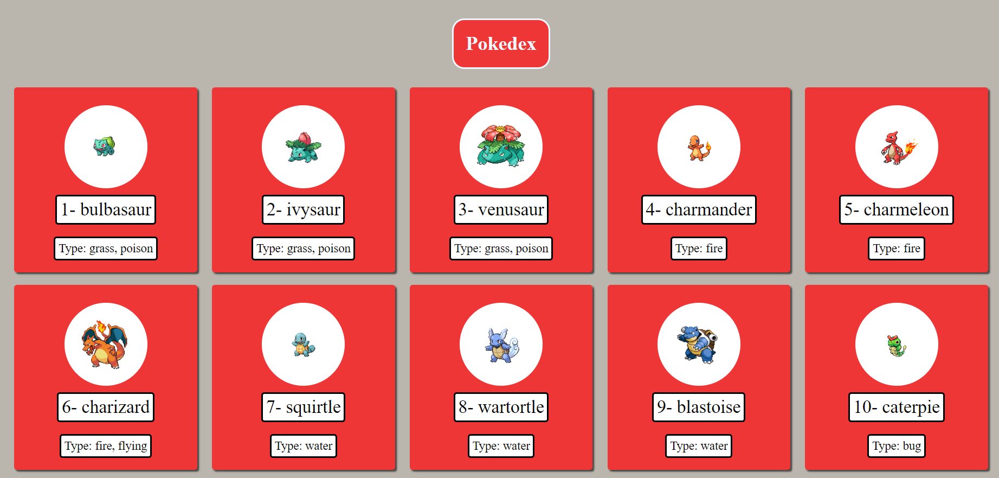

# Pokedex
This is a simple project just to train myself how to use a API .I used the PokeApi to do this. 💾
to check the real result just click [here](https://simple-pokedex-site.netlify.app)

# Api link
Here the app will show the photo,name and the type of each pokemon.
If you wanna create a pokedex too just follow the [Link](https://pokeapi.co)

# Design 🖥️

This was a simple design in future i will add a search bar to find the pokemons automatically.

